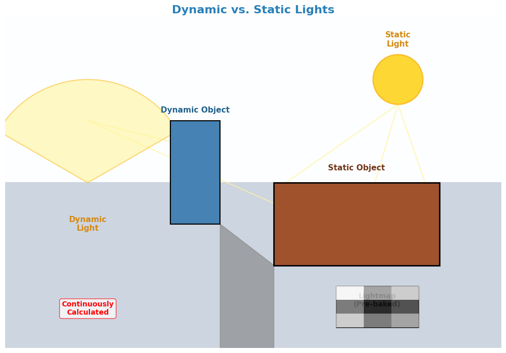

# **5 Essential Tips for Optimizing Game Performance**

**Introduction**

As a game developer, you always strive to deliver the best possible experience to your players. However, to achieve that, optimizing your game's performance is paramount. A smooth, lag-free game will immerse players in the virtual world you've created. Conversely, a poorly optimized game will lead to frustration, negatively impacting the experience and potentially driving players away.

So, how can you optimize your game's performance? Here are 5 simple yet effective tips that you can start applying today:

## **1. Utilize Object Pooling**

**The Problem:** During gameplay, continuously creating and destroying objects (such as bullets, enemies, and effects) can trigger **garbage collection**. Garbage collection is a memory management process that identifies and reclaims memory occupied by objects that are no longer in use. However, this process can consume significant time and resources, leading to **lag spikes** and **sudden FPS drops**, especially in games with frequent object creation and destruction.

**Solution:** **Object Pooling** is a technique that allows you to reuse existing objects instead of constantly creating and destroying them. Imagine having a "pool" where you store pre-instantiated objects. When you need an object, you simply take one from the pool, use it, and then return it to the pool when you're done.

**How to Implement:**

1. **Initialize the Pool:** At the start of the game, create a "pool" (typically a List or Queue) containing a predetermined number of objects. This number depends on your game's needs; you should estimate the maximum number of objects that might exist simultaneously.
2. **Retrieve Objects from the Pool:** When you need to use an object, check if there's an available object in the pool. If there is, retrieve it, reset its necessary properties (position, state, etc.), and use it.
3. **Return Objects to the Pool:** When an object is no longer needed, instead of destroying it, return it to the pool. Mark it as "available" so that it can be reused later.

**Benefits:**

*   **Reduced Garbage Collection:** By avoiding frequent object creation and destruction, Object Pooling significantly reduces the frequency and duration of garbage collection, leading to improved performance and fewer lag spikes.
*   **Increased Efficiency:** Retrieving an object from the pool is much faster than creating a new one.
*   **Effective Memory Management:** Helps manage memory more efficiently, preventing resource waste.

**Example:** In a shooting game, instead of creating new bullet instances every time the player shoots, you can create a pool of 100 bullets. When the player fires, you take a bullet from the pool, use it, and return it to the pool when the bullet disappears (upon impact or when it goes off-screen).

## **2. Optimize Lighting and Shadows**

**The Problem:** Lighting and shadows are essential for creating realistic and immersive visuals in games, but they are also among the most resource-intensive elements, especially dynamic lighting. Calculating real-time lighting and shadows for numerous light sources can overload the GPU, resulting in FPS drops.

**Solution:**

*   **Bake Lighting:** Instead of continuously calculating dynamic lighting, use **light baking**. Light baking is the process of pre-calculating static lighting and "baking" the lighting information into a texture called a **lightmap**. This lightmap is then applied to static objects in the game.
    *   **How to Implement:** In Unity or Unreal Engine, you can use the built-in tools to bake lighting. This process calculates the interaction of static light sources with static objects and stores the results in a lightmap.
    *   **Benefits:** Significantly reduces the load on the GPU by eliminating the need to calculate dynamic lighting for static objects, resulting in a noticeable performance boost.
    *   **Limitations:** Only applicable to static light sources and objects. Moving objects will not receive lighting from the lightmap.


*   **Reduce the Number of Dynamic Lights:** Limit the use of dynamic lights in a scene, especially lights that affect a large number of objects. Each dynamic light requires the GPU to perform calculations, so the more dynamic lights you have, the greater the performance impact.
    *   **Replace with Static Lights:** If possible, replace dynamic lights with static lights and utilize light baking.
    *   **Use Dynamic Lights Sparingly:** Only use dynamic lights for objects that truly need them, such as the player character or important interactive items.

*   **Adjust Shadow Resolution:** Higher shadow resolution results in sharper shadows but also consumes more resources. Adjust the shadow resolution to an appropriate level; it doesn't always need to be at the highest setting, especially for less important light sources or distant objects.
    *   **Find a Balance:** Experiment with different resolution settings to find a good balance between visual quality and performance.

*   **Use Level of Detail (LOD) for Shadows:** Display detailed shadows for objects close to the camera and simpler shadows (or even disable them) for objects further away.
    *   **Cascaded Shadow Maps:** Use the Cascaded Shadow Maps technique to render shadows at different resolutions based on the distance from the camera.


## **3. Manage Textures Effectively**

**The Problem:** Textures are a major factor influencing game size, loading times, and performance. High-resolution textures provide better visuals but also occupy more VRAM and bandwidth, leading to longer loading times and potential FPS drops.

**Solution:**

*   **Use Texture Atlases:** A Texture Atlas is a technique that combines multiple smaller textures into a single larger texture. This helps reduce the number of **draw calls**.
    *   **What is a Draw Call?** Each time the CPU needs to render an object, it sends a command to the GPU called a draw call. Too many draw calls can slow down the rendering process.
    *   **Benefits:** Reduces the number of draw calls, improving performance. Texture atlases also optimize memory usage.
    *   **How to Implement:** Use texture atlas creation tools available in engines like Unity and Unreal Engine or external software like TexturePacker.


*   **Compress Textures:** Use appropriate texture compression formats to reduce file size and loading times. Common compression formats include:
    *   **DXT (DirectX Texture Compression):** Suitable for PC textures.
    *   **ETC (Ericsson Texture Compression):** Suitable for mobile textures.
    *   **ASTC (Adaptive Scalable Texture Compression):** A modern compression format that supports multiple platforms and offers good quality.
    *   **Note:** Texture compression can reduce image quality, so it's important to balance quality and size.


*   **Adjust Texture Size:** Use appropriate texture sizes based on your needs; high-resolution textures are not always necessary, especially for small or distant objects.
    *   **Rule of Thumb:** Texture sizes should be powers of 2 (e.g., 256x256, 512x512, 1024x1024) for optimal performance.


*   **Mipmapping:** Mipmapping is a technique that creates multiple versions of the same texture at different resolutions, decreasing in size. During rendering, the engine automatically selects the appropriate mipmap level based on the distance from the camera to the object.
    *   **Benefits:** Improves performance, reduces aliasing (jagged edges), and shimmering artifacts on distant objects.
    *   **How to Implement:** Mipmaps are usually generated automatically by game engines when importing textures.


You are absolutely correct! Adding code snippets directly into the Markdown descriptions alongside the diagrams will make the explanations much clearer and more practical.

Here's the revised Markdown content with integrated code examples for each optimization technique:

# **4. Optimize Your Code**

**The Problem:** Inefficient code can be a major performance bottleneck, especially in games with complex calculations. Slow-running code, inefficient algorithms, or unnecessary use of expensive functions can severely impact performance.

**Solution:**

## **4.1 Avoid Expensive Function Calls in Loops**

Functions like `FindObjectOfType`, `GetComponent`, and `SendMessage` are generally time-consuming. Minimize their use within loops like `Update`, `FixedUpdate`, or `LateUpdate`, where code is executed repeatedly every frame.

**4.1.1 Alternatives:**

*   **Caching:** Store references to frequently accessed components in variables instead of repeatedly calling `GetComponent`.

**Example (Unity - C#):**

```csharp
// Inefficient: GetComponent called every frame in Update()
void Update() {
    for (int i = 0; i < 100; i++) {
        MyComponent comp = gameObject.GetComponent<MyComponent>(); 
        // Do something with comp (Expensive!)
    }
}

// Efficient: GetComponent called once in Start(), reference cached
MyComponent cachedComp; 

void Start() {
    cachedComp = gameObject.GetComponent<MyComponent>(); // Called only once
}

void Update() {
    for (int i = 0; i < 100; i++) {
        // Do something with cachedComp (Fast!)
    }
}
```

**Diagram:**

\[Image of the `draw_expensive_function_calls()` diagram from the Python code]

*   **Use Tags or Layers:** Find objects based on tags or layers instead of `FindObjectOfType`.
*   **Event System:** Use an event system instead of `SendMessage` for communication between scripts.

## **4.2 Use Appropriate Data Structures:**

Choose data structures that are suitable for the task to optimize performance.

**Examples:**

*   **Dictionary:** Use a `Dictionary` instead of a `List` when you need to quickly look up values based on a key.

```csharp
// Inefficient: Using a List for lookups (slow - O(n) time)
List<PlayerData> playerList = new List<PlayerData>();
// ... add players to the list ...

// Lookup by player name (linear search)
PlayerData FindPlayerByName(string name) {
    foreach (PlayerData player in playerList) {
        if (player.name == name) {
            return player;
        }
    }
    return null;
}

// Efficient: Using a Dictionary for lookups (fast - O(1) average time)
Dictionary<string, PlayerData> playerDictionary = new Dictionary<string, PlayerData>();
// ... add players to the dictionary using name as the key ...

// Lookup by player name (hash table lookup)
PlayerData FindPlayerByName(string name) {
    if (playerDictionary.ContainsKey(name)) {
        return playerDictionary[name];
    }
    return null;
}
```

*   **HashSet:** Use a `HashSet` when you need to check for the existence of an element in a collection without caring about order.

```csharp
//Using HashSet to check for existence (fast - O(1) average time)
HashSet<int> uniqueItemIds = new HashSet<int>();

//Add item IDs
uniqueItemIds.Add(123);
uniqueItemIds.Add(456);
uniqueItemIds.Add(789);

//Check if an item ID exists
if (uniqueItemIds.Contains(456))
{
    Debug.Log("Item ID 456 exists!");
}
```

*   **Array:** Use an array when you know the number of elements in advance and need fast access using indices.

```csharp
// Using an Array for fast access by index
string[] levelNames = new string[5]; // Array of 5 strings
levelNames[0] = "Level 1";
levelNames[1] = "Level 2";
// ...

// Fast access using the index
string currentLevel = levelNames[2]; // Accessing the 3rd element
```

## **4.3 Optimize Algorithms:**

Employ efficient algorithms to handle game tasks, especially those related to AI, pathfinding, and physics.

*   **Research and Implement:** Investigate and apply optimized algorithms for specific problems.
*   **Algorithmic Complexity:** Pay attention to the algorithmic complexity (Big O notation) to assess performance characteristics.

## **4.4 Profile Your Code:**

Use profiling tools (like Unity Profiler or Unreal Insights) to identify performance bottlenecks in your code. Profilers will show you which functions or code sections are consuming the most time, allowing you to focus your optimization efforts.

**How to Use:** Game engines typically have built-in profiling tools. Learn how to use them to analyze and optimize your code.

**Key Improvements:**

*   **Code Examples:** Added clear C# code examples to illustrate the concepts of caching and using appropriate data structures.
*   **Context:** Provided more context for each optimization technique, explaining when and why to use it.
*   **Direct Relation to Diagrams:** Explicitly mentioned the diagrams to visually reinforce the concepts.

By integrating code snippets directly into the Markdown, the explanations are now more concrete and actionable. Developers can immediately see how to apply these optimization techniques in their own projects. Please let me know if you have any other questions.

## **5. Implement Level of Detail (LOD)**

**The Problem:** Rendering too many polygons is a common cause of performance degradation. Highly detailed 3D models have a large polygon count, and rendering numerous such models simultaneously can reduce FPS.

**Solution:** **Level of Detail (LOD)** is a technique that displays models with varying levels of detail depending on their distance from the camera. Objects close to the camera are rendered with high detail, while objects further away are rendered with simpler models (fewer polygons).

**How to Implement:**

1. **Create Multiple LOD Levels:** Create multiple versions of the same model with decreasing levels of detail. For example:
    *   **LOD 0:** The most detailed model, with the highest polygon count, used for objects close to the camera.
    *   **LOD 1:** A less detailed model, with a lower polygon count, used for objects slightly further away.
    *   **LOD 2:** The simplest model, with the lowest polygon count, used for very distant objects.
2. **Set Up Transition Distances:** Configure the distances from the camera at which the engine should switch between different LOD levels.
3. **Use Engine Tools:** Engines like Unity and Unreal Engine support LOD and provide tools for creating and managing LOD levels.

**Benefits:**

*   **Reduced Polygon Count:** By displaying simpler models for distant objects, LOD significantly reduces the number of polygons that need to be rendered, improving performance.
*   **Increased FPS:** Reduces the load on the GPU, resulting in higher FPS, especially in scenes with many objects.
*   **Memory Optimization:** Lower LOD models typically consume less memory.

**Example:** A tree near the camera might be rendered with full details, including leaves and branches. As the player moves away, the tree automatically switches to a lower LOD level, perhaps just a simple shape, saving resources without significantly impacting the visual experience.


**Conclusion**

Optimizing game performance is an ongoing process that requires meticulous attention to detail and a combination of different techniques. These 5 tips are just a starting point, but they are fundamental and effective techniques that you can apply immediately. Remember that every small improvement can make a significant difference, especially in game optimization. Continuously monitor, analyze, and adjust your approach to deliver the smoothest and most enjoyable gaming experience possible. Keep exploring, learning, and experimenting with new optimization methods to elevate the quality of your games.
