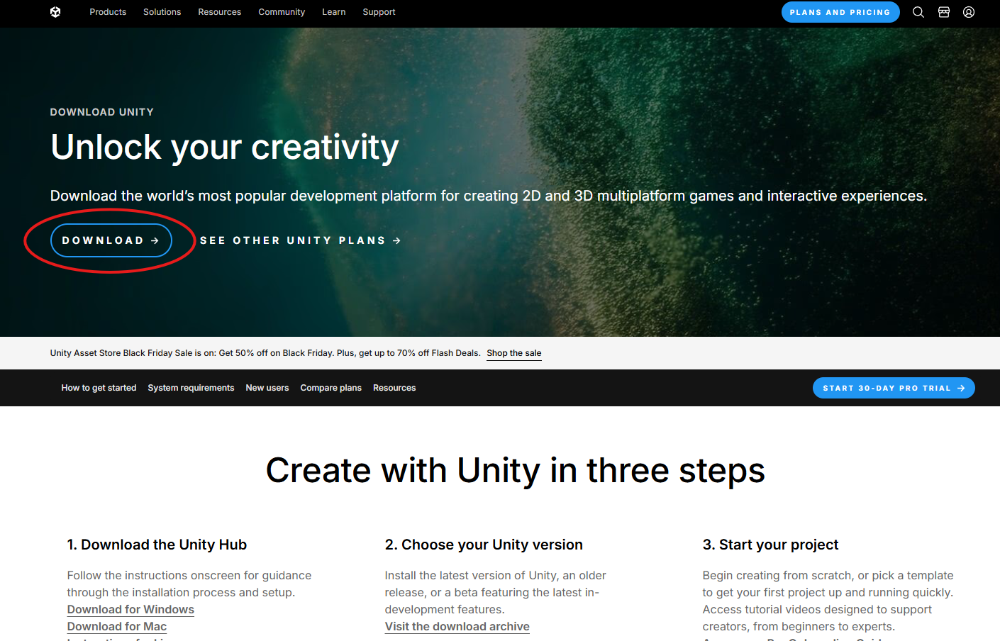

# **Hướng Dẫn Cài Unity, Cấu Hình Visual Studio và VSCode Cho Game Development**
:::tip
“Everybody has to start somewhere. You have your whole future ahead of you. Perfection doesn't happen right away.” 

“Mọi người đều phải bắt đầu từ đâu đó, con đường phía trước vẫn còn dài, và kiến thức cần thời gian.” 

**- Haruki Murakami**
:::

Trong bài viết này, chúng ta sẽ cùng nhau tìm hiểu cách **cài đặt Unity**, lấy **license**, và cấu hình môi trường làm việc với **Visual Studio** và **Visual Studio Code (VSCode)** để bắt đầu phát triển game. Đây là các bước cơ bản nhưng cực kỳ quan trọng trước khi bạn bắt tay vào việc tạo ra những tựa game của riêng mình.

## **1. Cài Đặt Unity Hub**

### **Bước 1: Tải và Cài Đặt Unity Hub**
Unity Hub là công cụ giúp bạn quản lý các phiên bản Unity và các dự án game dễ dàng. Để bắt đầu, bạn cần tải và cài đặt Unity Hub:

- Truy cập trang tải Unity Hub tại [Unity Download Page](https://unity.com/download).
- Chọn **"Download Unity Hub"** và tải về file cài đặt tương ứng với hệ điều hành của bạn (Windows hoặc macOS).
- Sau khi tải về, mở file cài đặt và làm theo các bước hướng dẫn để cài Unity Hub vào máy tính của bạn.

### **Bước 2: Đăng Nhập và Lấy License**

Sau khi cài đặt Unity Hub, bạn cần đăng nhập vào tài khoản **Unity ID** của mình và lấy license để có thể sử dụng phần mềm. Dưới đây là các bước chi tiết:

#### 1. **Mở Unity Hub**
   - Sau khi hoàn tất quá trình cài đặt **Unity Hub**, hãy mở ứng dụng này lên từ menu **Start** trên Windows hoặc từ **Applications** trên macOS.

#### 2. **Đăng Nhập Vào Unity ID**
   - Khi Unity Hub mở lên, bạn sẽ thấy màn hình yêu cầu đăng nhập. Tại đây, bạn cần nhập thông tin tài khoản **Unity ID**.
   - **Nếu bạn đã có tài khoản Unity ID:**
     - Nhập **Email** và **Mật khẩu** của tài khoản Unity ID đã đăng ký trước đó.
     - Nhấn **Sign In** (Đăng nhập).
   
   - **Nếu bạn chưa có tài khoản Unity ID:**
     - Chọn **Create Account** (Tạo tài khoản mới) ngay trên màn hình đăng nhập.
     - Bạn sẽ được chuyển hướng đến trang đăng ký tài khoản trên website của Unity. Hãy điền các thông tin cần thiết như Email, Mật khẩu, tên đầy đủ, và chọn quốc gia của bạn.
     - Sau khi hoàn tất, Unity sẽ gửi cho bạn một email xác nhận. Hãy mở email đó và nhấn vào **Verify Email** để hoàn tất quá trình tạo tài khoản.
     - Sau khi xác nhận, quay lại Unity Hub và đăng nhập với tài khoản mới của bạn.

#### 3. **Chọn Loại License**
   - Sau khi đăng nhập thành công, Unity Hub sẽ yêu cầu bạn chọn loại **license** bạn muốn sử dụng.
   
   - **Unity Personal (Miễn phí)**:
     - Nếu bạn mới bắt đầu học hoặc không sử dụng Unity cho mục đích thương mại, bạn có thể chọn **Personal**. Đây là license miễn phí và phù hợp với người dùng cá nhân, sinh viên hoặc các tổ chức có doanh thu dưới một mức nhất định (tính đến thời điểm hiện tại là dưới 100.000 USD mỗi năm).
     - Chọn **Personal** và nhấn **Activate** (Kích hoạt).
   
   - **Unity Pro (Trả phí)**:
     - Nếu bạn đã có tài khoản Unity Pro hoặc muốn sử dụng các tính năng cao cấp hơn, bạn cần chọn **Pro**. Bạn sẽ cần nhập thông tin thẻ tín dụng và thanh toán để kích hoạt license này.
     - Chọn **Pro** và làm theo các bước thanh toán.

#### 4. **Hoàn Tất Quá Trình Kích Hoạt License**
   - Sau khi bạn chọn **Personal** hoặc **Pro**, Unity Hub sẽ tự động kích hoạt license cho bạn.
   - Bạn sẽ thấy thông báo xác nhận về việc kích hoạt thành công. Từ giờ, bạn có thể sử dụng Unity mà không bị giới hạn.
   
#### 5. **Kiểm Tra License**
   - Để kiểm tra xem license đã được kích hoạt chưa, bạn có thể vào **Account Settings** (Cài đặt tài khoản) trong Unity Hub và xem phần **License**. Nếu bạn thấy “Personal” hoặc “Pro” ở đó, điều này có nghĩa là license đã được áp dụng thành công.

## **2. Cài Đặt và Cấu Hình Unity Editor**

### **Bước 1: Cài Đặt Unity Version**
Với Unity Hub, bạn có thể dễ dàng cài đặt các phiên bản Unity khác nhau. Để bắt đầu phát triển game, hãy làm theo các bước sau:

1. **Mở Unity Hub**
   - Sau khi cài đặt **Unity Hub**, mở ứng dụng này lên. Bạn sẽ thấy giao diện chính của Unity Hub, nơi có các tab như **Projects**, **Installs**, **Learn**, và **Community**.

2. **Chọn Tab “Installs”**
   - Vào tab **Installs** để xem các phiên bản Unity đã cài đặt hoặc thêm phiên bản mới.

    <!-- Hình ảnh minh họa cho tab Installs -->

3. **Nhấn “Install Editor” để Cài Đặt Phiên Bản Unity Mới**
   - Nhấn nút **Install Editor** ở góc trên bên phải của tab **Installs** trong Unity Hub để mở cửa sổ chọn phiên bản Unity.
   - Bạn sẽ thấy danh sách các phiên bản Unity. Chọn một trong các tùy chọn dưới đây:
     - **LTS (Long Term Support)**: Phiên bản ổn định, được hỗ trợ lâu dài, thích hợp cho các dự án dài hạn.
     - **Latest Release**: Phiên bản mới nhất có tính năng cập nhật nhanh nhưng có thể không ổn định như LTS.

   - Để chọn một phiên bản khác(truờng hợp muốn lấy chính xác phiên bản), nhấn vào **Add from Archive** để truy cập kho lưu trữ các phiên bản Unity cũ.
 <!-- Hình ảnh minh họa cho chọn phiên bản Unity -->

4. **Tiếp Tục Cài Đặt**
   - Sau khi chọn phiên bản Unity, Unity Hub sẽ tự động tải xuống và cài đặt Unity Editor. Bạn sẽ được yêu cầu chọn vị trí cài đặt và các tính năng bổ sung (chẳng hạn như hỗ trợ cho Android, iOS, hoặc WebGL).
   - Nhấn **Next** và đợi quá trình cài đặt hoàn tất.
   - Trong trường hợp này bạn nên chọn các option mà cá nhân bạn cần cho việc phát triển, bạn sẽ thấy các tùy chọn sau để chọn cài đặt:
    ### Các Tùy Chọn Cài Đặt Unity cho Windows:
    - **Windows Build Support (IL2CPP)**: Cần thiết nếu bạn phát triển game cho nền tảng Windows.
    - **Windows Dedicated Server Build Support**: Dành cho những ai phát triển các game server độc lập.
    - **WebGL Build Support**: Nếu bạn muốn xuất game của mình lên nền tảng web.
    - **Android Build Support**: Để phát triển game cho thiết bị Android.
    - **Microsoft Visual Studio Community**: Cài đặt nếu bạn chưa có môi trường lập trình, vì Unity sử dụng Visual Studio làm IDE chính cho việc lập trình C#.
    - **iOS Build Support**: Để phát triển game cho các thiết bị Apple như iPhone và iPad.
    - **Mac Build Support**: Dành cho phát triển game trên hệ điều hành macOS.
    - **Linux Build Support**: Nếu bạn muốn xuất game cho hệ điều hành Linux.
    - **Universal Windows Platform (UWP)**: Dành cho phát triển game cho các thiết bị chạy Windows 10 và các thiết bị hỗ trợ UWP.
    - **Tizen Build Support**: Để phát triển game cho các thiết bị chạy hệ điều hành Tizen (chẳng hạn như các thiết bị của Samsung).
    - **TVOS Build Support**: Dành cho phát triển game cho các thiết bị Apple TV.

    ### **Tùy chọn có yêu cầu license đặc biệt:**
    - **Xbox Build Support**: Cần có license và thỏa thuận cấp phép Unity Pro để phát triển game cho Xbox.
    - **PlayStation Build Support**: Cần có license và thỏa thuận cấp phép Unity Pro để phát triển game cho PlayStation.

   - Chọn các tùy chọn phù hợp với dự án của bạn và nhấn **Next**. Quá trình cài đặt sẽ bắt đầu và bạn cần đợi cho đến khi hoàn tất.

    <!-- Hình ảnh minh họa cho quá trình cài đặt -->

### **Lưu Ý Quan Trọng**
- **Đảm bảo phiên bản Unity bạn cài là phiên bản LTS** nếu bạn muốn sự ổn định trong suốt quá trình phát triển, đặc biệt nếu bạn đang làm một dự án dài hạn.
- **Đảm bảo đã chọn đúng công cụ hỗ trợ** (Android, WebGL, v.v.) dựa trên nền tảng mà bạn muốn phát triển game.
- **Kiểm tra yêu cầu hệ thống** của Unity để đảm bảo máy tính của bạn đủ mạnh để chạy Unity Editor mượt mà.

Cảm ơn bạn đã làm rõ! Dưới đây là hướng dẫn cập nhật cho việc cài đặt các công cụ hỗ trợ Unity trong **Visual Studio** mà không cần cài đặt lại Visual Studio từ đầu, vì **Visual Studio Installer** sẽ tự động mở sau khi cài Unity xong.

## **3. Tiếp Tục Cài Đặt Unity và Visual Studio**

### **Bước 1: Cài Đặt Các Extension trong Visual Studio Installer**

Sau khi cài đặt Unity xong, **Visual Studio Installer** sẽ tự động mở và bạn sẽ cần chọn các công cụ hỗ trợ Unity.

1. **Mở Visual Studio Installer**:
   - Sau khi cài Unity xong, **Visual Studio Installer** sẽ mở tự động. Nếu không, bạn có thể mở lại từ Start Menu hoặc trong danh sách ứng dụng của máy.

2. **Chọn Phiên Bản Visual Studio**:
   - Trong **Visual Studio Installer**, chọn phiên bản **Visual Studio** mà bạn đã cài (thường là **Visual Studio Community**).

3. **Cài Đặt Các Công Cụ Hỗ Trợ Cho Unity**:
   - Trong cửa sổ **Modify**, chọn các **Workloads** và **Individual Components** cần thiết:

#### **Workloads**:
- **Game Development with Unity**:
  - Cung cấp tất cả các công cụ hỗ trợ cần thiết để phát triển game với Unity, bao gồm các extension cho Unity trong Visual Studio, các công cụ lập trình C#, và hỗ trợ gỡ lỗi (debugger).

#### **Individual Components**:
- **.NET Desktop Development**: Cung cấp các công cụ cần thiết cho lập trình C#.
- **Desktop Development with C++**: Hỗ trợ biên dịch các tệp C++ trong Unity.
- **Unity Debugger**: Giúp gỡ lỗi các dự án Unity trực tiếp từ Visual Studio.
- **Visual Studio Tools for Unity**: Cung cấp tích hợp hoàn chỉnh giữa Unity và Visual Studio, bao gồm IntelliSense, code completion, và debugging.

4. **Cài Đặt Các Công Cụ**:
   - Sau khi chọn các công cụ cần thiết, nhấn **Install** để bắt đầu cài đặt. Chờ quá trình hoàn tất.

Dưới đây là hướng dẫn chi tiết về cách cấu hình **Visual Studio Code** (VSCode) làm IDE cho Unity. Hướng dẫn này sẽ giúp bạn tận dụng tối đa VSCode trong quá trình phát triển game với Unity, đặc biệt nếu bạn không muốn sử dụng IDE nặng nề như **Visual Studio**.

## **4. Cấu Hình Visual Studio Code (VSCode) Cho Unity**

Nếu bạn muốn sử dụng **Visual Studio Code** thay vì **Visual Studio**, bạn có thể cấu hình VSCode làm IDE chính cho Unity. VSCode là một lựa chọn nhẹ và linh hoạt cho việc phát triển game, giúp bạn tiết kiệm tài nguyên hệ thống trong khi vẫn có thể lập trình hiệu quả.

### **Bước 1: Cài Đặt Visual Studio Code**

1. **Tải và Cài Đặt Visual Studio Code**:
   - Truy cập [VSCode Download](https://code.visualstudio.com/).
   - Tải về bản cài đặt tương ứng với hệ điều hành của bạn (Windows, macOS, Linux).
   - Sau khi tải xong, mở tệp cài đặt và làm theo hướng dẫn để cài đặt **Visual Studio Code** vào máy tính của bạn.

2. **Mở Visual Studio Code**:
   - Sau khi cài đặt thành công, mở **Visual Studio Code** từ menu Start hoặc từ biểu tượng trên màn hình.

### **Bước 2: Cài Các Extension Cần Thiết Cho Unity**

Để làm việc với Unity, bạn cần cài đặt các extension hỗ trợ lập trình C# và gỡ lỗi. Đây là những công cụ quan trọng giúp bạn phát triển hiệu quả hơn trong môi trường Unity.

1. **Cài Extension C# for Visual Studio Code**:
   - Mở **Visual Studio Code**, chọn **View > Extensions** hoặc nhấn **Ctrl+Shift+X** để mở cửa sổ **Extensions**.
   - Tìm kiếm và cài đặt extension **C# for Visual Studio Code** từ **Microsoft**.
   - Extension này cung cấp hỗ trợ **IntelliSense**, **debugging**, và các tính năng lập trình C# cần thiết cho Unity.

2. **Cài Extension Unity Snippets**:
   - Để làm việc hiệu quả hơn, cài đặt thêm **Unity Snippets** extension.
   - Extension này giúp bạn sử dụng các đoạn mã mẫu (snippets) cho Unity, giúp tiết kiệm thời gian khi viết mã.

3. **Cài Extension Debugger for Unity**:
   - Extension này giúp tích hợp với Unity, cho phép bạn gỡ lỗi trực tiếp từ **VSCode**.
   - Mở cửa sổ **Extensions** trong VSCode và tìm kiếm **Debugger for Unity**. Cài đặt extension này để có thể debug trực tiếp các dự án Unity của bạn.

### **Bước 3: Cấu Hình VSCode Làm IDE Cho Unity**

1. **Mở Unity và Chọn Dự Án**:
   - Khởi động Unity và mở dự án mà bạn muốn phát triển.

2. **Đi đến Preferences trong Unity**:
   - Trong Unity, chọn **Edit > Preferences** (trên Windows) hoặc **Unity > Preferences** (trên macOS).

3. **Chọn External Tools**:
   - Trong cửa sổ **Preferences**, chọn tab **External Tools**.

4. **Cấu Hình Visual Studio Code Là External Script Editor**:
   - Trong mục **External Script Editor**, từ danh sách thả xuống **External Script Editor** hiện ra, chọn **Visual Studio Code**.
     - Nếu **Visual Studio Code** không xuất hiện trong danh sách, bạn có thể nhấn **Browse** và tìm đường dẫn tới tệp thực thi của VSCode (thường nằm ở `C:\Program Files\Microsoft VS Code\Code.exe` trên Windows).
   
5. **Cấu Hình Các Extension Cần Thiết**:
   - Đảm bảo rằng bạn đã cài đặt đầy đủ các extension trong **Visual Studio Code** để có trải nghiệm lập trình tốt nhất. Các extension cần cài bao gồm:
     - **C# for Visual Studio Code**: Cung cấp hỗ trợ đầy đủ cho C# trong Unity.
     - **Unity Snippets**: Để sử dụng các đoạn mã mẫu trong Unity.
     - **Debugger for Unity**: Để gỡ lỗi các dự án Unity từ VSCode.

### **Bước 4: Kiểm Tra và Bắt Đầu Làm Việc Với VSCode**

1. **Kiểm Tra Cấu Hình**:
   - Mở một **C# Script** trong Unity, nhấp đúp vào tệp script và nó sẽ tự động mở trong **Visual Studio Code** nếu bạn đã cấu hình đúng.
   - Kiểm tra xem các tính năng như **IntelliSense**, **bracket matching**, và **code navigation** có hoạt động tốt không.

2. **Debugging**:
   - Để bắt đầu gỡ lỗi, mở **VSCode**, nhấn **F5** để bắt đầu phiên gỡ lỗi. Nếu bạn muốn gỡ lỗi một **Unity Standalone Player**, sử dụng lệnh **Attach Unity Debugger**.
   - Đảm bảo rằng bạn đã cấu hình chính xác các cài đặt gỡ lỗi trong VSCode và Unity.

### **Lưu Ý Quan Trọng**

- **Cài Đặt .NET SDK**: Đảm bảo rằng bạn đã cài đặt **.NET SDK** trên máy tính của mình. .NET SDK rất quan trọng vì Unity sử dụng C# và .NET để phát triển game.
  - Bạn có thể tải .NET SDK từ [DotNet](https://dotnet.microsoft.com/download).
  - Sau khi cài đặt, kiểm tra bằng lệnh `dotnet --version` trong terminal để đảm bảo nó đã được cài đặt chính xác.

- **Kiểm Tra Unity Version**: Đảm bảo rằng bạn đang sử dụng phiên bản Unity tương thích với các công cụ và extension mà bạn đã cài đặt. Phiên bản Unity 2021 hoặc mới hơn thường sẽ hoạt động tốt nhất.

## **5. Kiểm Tra Cấu Hình và Tạo Dự Án Mới**

### **Bước 1: Tạo Dự Án Mới Trong Unity**
1. **Mở Unity Hub**:
   - Mở **Unity Hub**, nếu bạn chưa có Unity Hub, bạn có thể tải và cài đặt nó từ trang web chính thức của Unity.

2. **Tạo Dự Án Mới**:
   - Trong **Unity Hub**, chọn **New Project**.
   - Chọn loại **template** dự án bạn muốn (2D, 3D, v.v.).
   - Đặt tên cho dự án của bạn và chọn **vị trí lưu** cho dự án.

3. **Tạo Dự Án**:
   - Sau khi điền tên và vị trí, nhấn **Create** để Unity tạo dự án mới.

### **Bước 2: Mở Dự Án Và Kiểm Tra Cấu Hình**
1. **Mở Dự Án**:
   - Khi dự án đã được tạo thành công, Unity sẽ mở dự án đó.
   
2. **Tạo Script Mới**:
   - Trong Unity, nhấp chuột phải vào thư mục **Assets**, chọn **Create > C# Script**.
   - Đặt tên cho script mới.

3. **Mở Script Trong VSCode**:
   - Sau khi tạo script, nhấp đúp vào script để mở nó trong **Visual Studio Code**.
   - VSCode sẽ tự động mở script và bạn sẽ thấy mã nguồn C# trong cửa sổ **Editor** của VSCode.

4. **Kiểm Tra IntelliSense**:
   - Trong VSCode, thử gõ một số từ khóa C# và kiểm tra xem **IntelliSense** có hoạt động không (đưa ra các gợi ý và tự động hoàn thành).
   - Nếu có, điều đó có nghĩa là **Visual Studio Code** đã được cấu hình thành công để làm việc với Unity.

5. **Kiểm Tra Debugging**:
   - Để kiểm tra khả năng gỡ lỗi, bạn có thể đặt một điểm dừng (breakpoint) trong **VSCode**.
   - Sau đó, quay lại Unity và nhấn **Play** để chạy trò chơi.
   - Nếu mọi thứ đã được cấu hình đúng, **VSCode** sẽ dừng lại tại điểm dừng và cho phép bạn kiểm tra và gỡ lỗi mã nguồn trực tiếp từ IDE.
